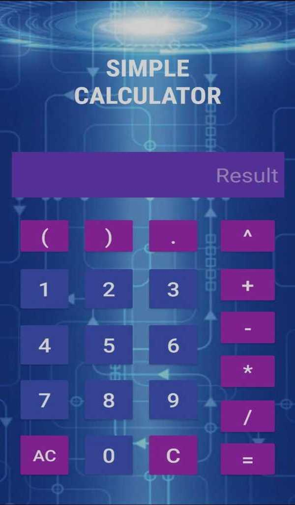
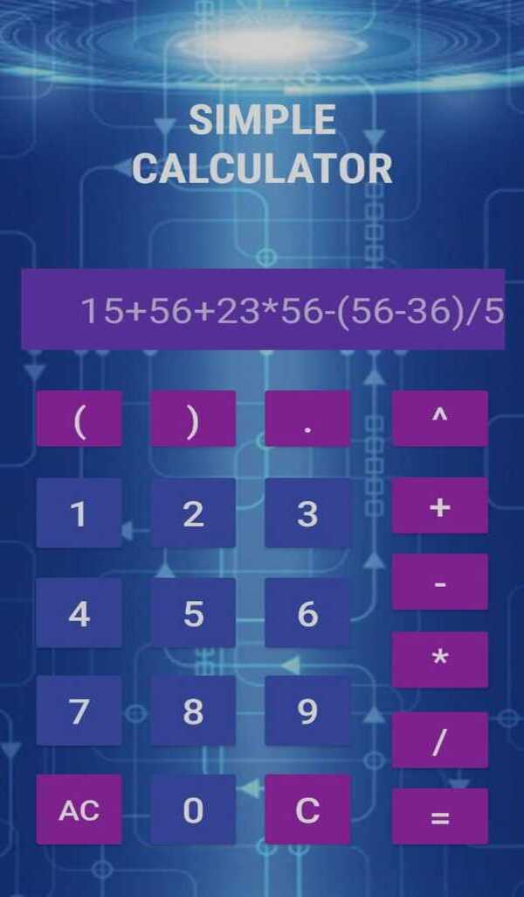
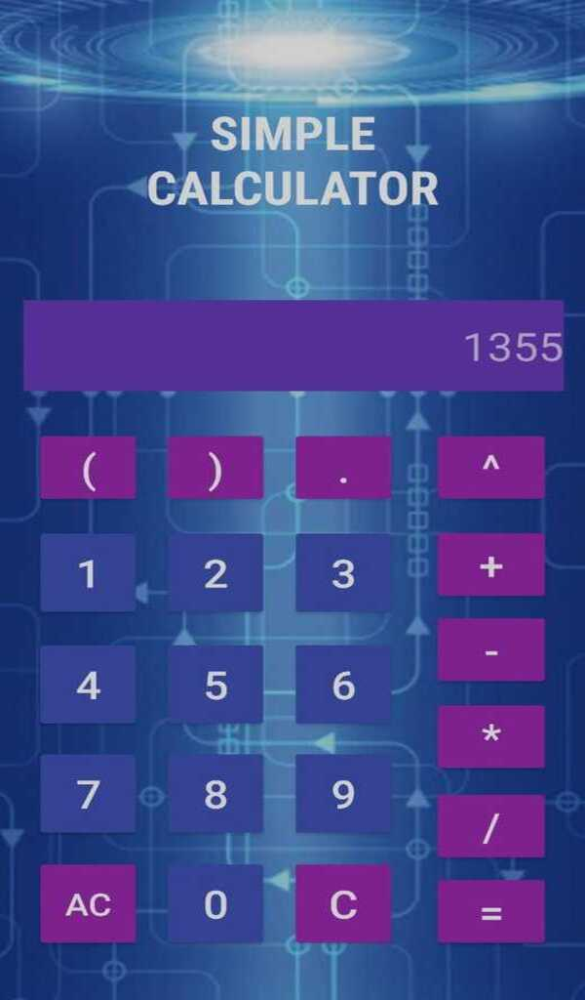

# Simple Calculator
A calculator built in Android Native (Java).

__All the basic operations__ (Addition, Subtraction, Multiplication, Division and Exponentation) can be performed in Simple Calculator.

### Screenshots
   

#### Download
https://www.amazon.com/gp/product/B093SXHL9Z
